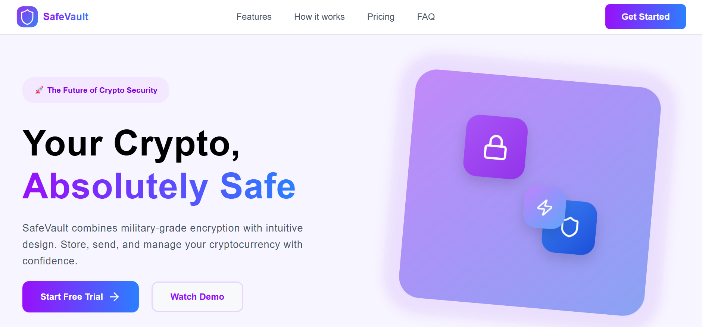

# 🛡️ SafeVault — Non-Custodial Crypto Asset Dashboard

SafeVault is a premium, high-fidelity responsive frontend landing page for a decentralized, non-custodial cryptographic container platform. This platform provides users with absolute control over digital wallet infrastructure with structural clarity, performance-driven layouts, and transparent pricing controls.



## 🚀 Live Demo
🔗 **[View Live Project URL Here](https://safevault-landing-page.vercel.app/)**

---

## 💎 Key Features

* **Premium Interactive State Toggles:** A robust, dynamic monthly/annual subscription cost matrices engine backed by state-driven pricing cards.
* **Hardware-Accelerated UI Drawer:** Completely tailored custom mobile side navigation drawer leveraging smooth, cubic-bezier timing vectors that glide effortlessly out of view on smaller screens.
* **Modern Glassmorphism Design:** Sophisticated navbar panels featuring translucent blurs (`backdrop-filter: blur`) and linear color gradient overlays (`-webkit-background-clip: text`).
* **Pure CSS Morphing Hamburger:** High-contrast layout toggler built entirely with semantic elements that morph cleanly into an interaction close crossbar.
* **Vector Scalability:** Direct inline structural SVG integration across background pseudo-elements to reduce server image payload requirements.

---

## 🛠️ Architecture & Tech Stack

* **Frontend Library:** React.js (Functional Components & Hooks)
* **Styling Architecture:** CSS Modules (`Navbar.module.css`, `Pricing.module.css`) for isolated, collision-free local scoping.
* **Responsive Framework:** Custom CSS Fluid Flexbox and Grid Breakpoints (`1024px`, `768px`, `480px`) completely replacing dependency on legacy monolithic UI utility blocks.
* **State Management:** React `useState` Hooks controlling contextual visual rendering branches.

---

## 📂 Structural Code Directory

```text
src/
├── assets/
│   └── icons/                 # SVG and branding assets
├── components/
│   ├── Common/                # Reusable icon components
│   │   ├── ArrowIcon.jsx
│   │   ├── BoltIcon.jsx
│   │   ├── LockIcon.jsx
│   │   ├── Logo.jsx
│   │   └── ShieldIcon.jsx
│   ├── FAQ/                   # Frequently Asked Questions accordion
│   │   ├── FAQ.jsx
│   │   └── FAQ.module.css
│   ├── Features/              # Feature grid
│   │   ├── Features.jsx
│   │   └── Features.module.css
│   ├── Footer/
│   │   ├── Footer.jsx
│   │   └── Footer.module.css
│   ├── Hero/                  # Above-the-fold section
│   │   ├── Hero.jsx
│   │   └── Hero.module.css
│   ├── JoinUs/                # Call-to-action section
│   │   ├── JoinUs.jsx
│   │   └── JoinUs.module.css
│   ├── Navbar/                # Navigation with responsive drawer
│   │   ├── Navbar.jsx
│   │   └── Navbar.module.css
│   ├── Pricing/               # Pricing matrix with toggle
│   │   ├── Pricing.jsx
│   │   └── Pricing.module.css
│   ├── Steps/                 # "How it works" timeline
│   │   ├── Steps.jsx
│   │   └── Steps.module.css
│   └── Testimonials/          # Social proof carousel
│       ├── Testimonials.jsx
│       └── Testimonials.module.css
└── styles/
    ├── global.css             # Global styles and font setup
    ├── reset.css              # Browser normalization
    └── variables.css          # Design tokens and color palette
```

---
## 🚀 Getting Started

### Prerequisites
- Node.js (v16 or higher)
- npm or yarn

### Installation & Local Development

```bash
# Clone the repository
git clone https://github.com/akvr000/safevault-landing-page.git

# Navigate to project
cd safevault

# Install dependencies
npm install

# Start development server
npm start
```

The app will run on `http://localhost:3000`

### Build for Production
```bash
npm run build
```

---

## 💡 Implementation Highlights

- **Zero Cumulative Layout Shift (CLS)** — Fixed container heights prevent card jumping during state changes
- **Component Reusability** — Icon components and styling patterns are modular and extensible
- **Accessibility** — Semantic HTML, ARIA labels, and keyboard navigation support
- **Performance** — Inline SVG reduces image requests; CSS Modules prevent style conflicts

---

## 🔮 Future Enhancements

- Live crypto price tracking integration
- Web3 wallet integration
- Enhanced FAQ search functionality

---

## 📚 Learning Outcomes

This project demonstrates:
- Building responsive React applications with custom CSS
- Managing component state and side effects with hooks
- Implementing modern CSS features (backdrop-filter, CSS Grid, Flexbox)
- Mobile-first design principles and breakpoint strategy

---

## 📄 License

This project is open for educational and portfolio review purposes.

**Attribution:** If you use code, design patterns, or CSS techniques from this project, please provide appropriate credit.

**Usage:** Commercial use without permission is not allowed. Educational use and portfolio display are welcome.

---

**Built by:** akvr000 | [GitHub](https://github.com/akvr000) | [LinkedIn](https://linkedin.com/in/akvr000)


